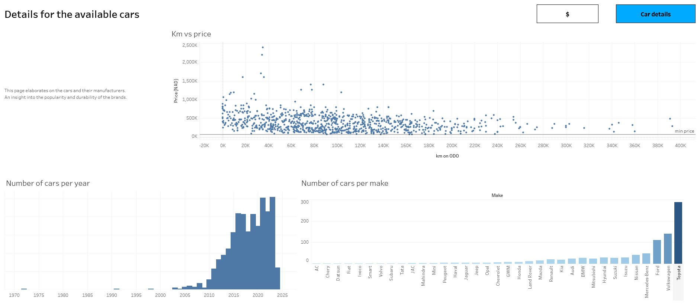

# Exploratory-data-analysis-3
Understanding the second-hand car market in Namibia  
  
 
  
### Data source 
The data was scraped from a local car website called [namcars.net](namcars.net)  
  
### Final grpahs can be seen on [Tableau](https://public.tableau.com/app/profile/janko.bauer/viz/Second-handmarket_17302084534200/Financialdetails)  
   

## Process
1. Scraping all data
    - Single script that returns data for a few car types and all cars collectivley. 
3. Processing
    - Verify all data is correct
    - Correct minor discrepencies from the data
    - Format for visualization
3. Presenting the most interesting info on Tableau  

  
  
## Sceenshots of the dashboards
  

